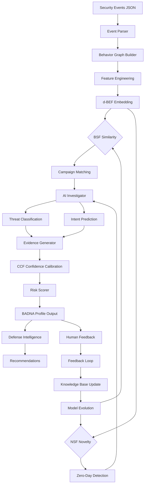

# BADNA Technical Design Document

## Overview

### System Purpose

BADNA (Behavioral Attack DNA Analysis Framework) is a cybersecurity research framework that represents attacker behavior as mathematical behavioral fingerprints rather than relying on signatures, rules, or static indicators. The system provides:

- **Behavioral Fingerprinting**: Converts attack sequences into mathematical embeddings (Behavior DNA)
- **Zero-Day Detection**: Identifies unknown attacks through novelty detection
- **Explainable AI**: Provides transparent evidence for all threat assessments
- **Continuous Learning**: Improves accuracy through analyst feedback and model evolution
- **Enterprise Scalability**: Processes large-scale security event streams efficiently

### Core Innovation

BADNA introduces four novel research algorithms that form the mathematical foundation of behavioral analysis:

1. **d-BEF (Directed Behavioral Embedding Function)**: Converts directed behavior graphs into fixed 128-dimensional vectors using spectral graph theory
2. **BSF (Behavioral Similarity Function)**: Measures behavioral similarity between attacks using weighted cosine similarity with structural, temporal, and semantic components
3. **NSF (Novelty Score Function)**: Detects zero-day attacks using distance-based anomaly detection with locality-sensitive hashing
4. **CCF (Confidence Calibration Function)**: Calibrates prediction confidence using Platt scaling with evidence quality assessment

### System Boundaries

**In Scope:**
- Behavioral capture and graph construction from security events
- Mathematical embedding generation and similarity computation
- Threat classification and intent prediction
- Novelty detection for unknown attack patterns
- Confidence calibration and risk scoring
- Knowledge base management and continuous learning
- REST API for integration with security platforms

**Out of Scope:**
- Raw event collection from endpoints (assumes pre-collected security logs)
- Automated response/remediation actions (provides recommendations only)
- Real-time streaming at sub-second latency (designed for batch/near-real-time)
- Signature-based malware detection (behavior-only focus)
- Network packet inspection (operates on event-level data)

### Key Design Decisions

1. **Graph-Based Representation**: Behavior graphs preserve causality and temporal relationships better than flat feature vectors
2. **Spectral Embeddings**: Directed Laplacian spectral methods capture graph topology in fixed-size vectors suitable for similarity computation
3. **Ensemble Classification**: Multiple algorithms reduce overfitting and improve generalization
4. **Incremental Learning**: Allows model updates without full retraining as new patterns emerge
5. **Modular Architecture**: Independent components enable testing, replacement, and extension
6. **JSON-Based Storage**: Human-readable persistence simplifies debugging and integration

---

## Architecture

### High-Level Architecture

```
┌─────────────────────────────────────────────────────────────────┐
│                     External Systems                             │
│  (SIEM, EDR, Log Aggregators, Security Orchestration)          │
└────────────────────────┬────────────────────────────────────────┘
                         │ REST API (JSON/HTTP)
                         ▼
┌─────────────────────────────────────────────────────────────────┐
│                    BADNA API Layer                               │
│  - Authentication & Authorization                                │
│  - Input Validation & Rate Limiting                              │
│  - Request Routing & Response Formatting                         │
└────────────────────────┬────────────────────────────────────────┘
                         ▼
┌─────────────────────────────────────────────────────────────────┐
│              Behavioral Capture Engine                           │
│  - Event Parser                                                  │
│  - Graph Builder (graph_builder.py)                              │
│  - Feature Extraction (feature_engineering.py)                   │
└────────────────────────┬────────────────────────────────────────┘
                         ▼
┌─────────────────────────────────────────────────────────────────┐
│                   BADNA Engine (Core)                            │
│  ┌────────────────┐  ┌────────────────┐  ┌──────────────────┐  │
│  │ d-BEF Engine   │  │ BSF Engine     │  │ NSF Engine       │  │
│  │ (dbef.py)      │  │ (bsf.py)       │  │ (nsf.py)         │  │
│  │ Embedding Gen  │  │ Similarity     │  │ Novelty Score    │  │
│  └────────────────┘  └────────────────┘  └──────────────────┘  │
│  ┌────────────────┐  ┌────────────────┐  ┌──────────────────┐  │
│  │ CCF Engine     │  │ AI Investigator│  │ Risk Scorer      │  │
│  │ (ccf.py)       │  │ (investigator) │  │                  │  │
│  │ Confidence Cal │  │ Class/Intent   │  │                  │  │
│  └────────────────┘  └────────────────┘  └──────────────────┘  │
└────────────────────────┬────────────────────────────────────────┘
                         ▼
┌─────────────────────────────────────────────────────────────────┐
│                Intelligence & Learning                           │
│  ┌────────────────┐  ┌────────────────┐  ┌──────────────────┐  │
│  │ Evidence Gen   │  │ Defense Intel  │  │ Feedback Loop    │  │
│  │ (evidence.py)  │  │ (classifier)   │  │ (feedback.py)    │  │
│  └────────────────┘  └────────────────┘  └──────────────────┘  │
│  ┌────────────────┐  ┌────────────────┐                         │
│  │ Model Evolution│  │ Knowledge      │                         │
│  │ (evolution.py) │  │ Update         │                         │
│  └────────────────┘  └────────────────┘                         │
└────────────────────────┬────────────────────────────────────────┘
                         ▼
┌─────────────────────────────────────────────────────────────────┐
│                   Persistence Layer                              │
│  ┌────────────────────────────────────────────────────────────┐ │
│  │ Behavioral Knowledge Base (behavior_memory.json)           │ │
│  │ - Learned behavior vectors with metadata                   │ │
│  │ - Threat classifications and confidence scores             │ │
│  └────────────────────────────────────────────────────────────┘ │
│  ┌────────────────────────────────────────────────────────────┐ │
│  │ Campaign Memory (campaigns.json)                           │ │
│  │ - Attack campaign profiles and signatures                  │ │
│  │ - Historical attack patterns and attribution               │ │
│  └────────────────────────────────────────────────────────────┘ │
└─────────────────────────────────────────────────────────────────┘
```

### Component Responsibilities


| Component | Responsibility | Key Functions |
|-----------|---------------|---------------|
| **Behavioral Capture Engine** | Parse raw security events and construct directed behavior graphs | `parse_events()`, `build_graph()`, `extract_features()` |
| **d-BEF Engine** | Convert behavior graphs to 128-D embeddings using spectral methods | `compute_embedding()`, `directed_laplacian()`, `spectral_decomposition()` |
| **BSF Engine** | Compute behavioral similarity between embeddings | `calculate_similarity()`, `weighted_cosine()`, `match_campaign()` |
| **NSF Engine** | Detect novel/zero-day attacks through anomaly detection | `compute_novelty()`, `lsh_candidate_selection()`, `local_outlier_factor()` |
| **CCF Engine** | Calibrate confidence scores for predictions | `calibrate_confidence()`, `platt_scaling()`, `evidence_quality()` |
| **AI Investigator** | Classify threats and predict attacker intent | `classify_threat()`, `predict_intent()`, `map_to_mitre()` |
| **Evidence Generator** | Produce explainable evidence for detections | `generate_evidence()`, `extract_features()`, `format_explanation()` |
| **Defense Intelligence** | Recommend defensive actions | `recommend_actions()`, `prioritize_responses()`, `estimate_effectiveness()` |
| **Feedback Loop** | Process analyst feedback for continuous learning | `accept_feedback()`, `update_weights()`, `aggregate_statistics()` |
| **Model Evolution** | Retrain and evolve models based on new data | `trigger_retraining()`, `cross_validate()`, `version_models()` |
| **Knowledge Base** | Persist and query learned behavioral patterns | `store_pattern()`, `query_by_similarity()`, `query_by_class()` |

### Data Flow



### Processing Pipeline

The BADNA system follows a fixed processing pipeline (FROZEN - cannot be modified):

1. **Incoming Threat** → Raw security event data (JSON format)
2. **Adaptive Honeypot** → Event capture and preprocessing
3. **Behavior Capture Engine** → Graph construction from events
4. **Feature Engineering** → Statistical and structural feature extraction
5. **BADNA Engine** → Core mathematical processing:
   - d-BEF: Embedding generation
   - BSF: Similarity computation
   - NSF: Novelty detection
   - Risk Generation: Threat severity scoring
   - Intent Prediction: Attacker goal estimation
   - Evidence Generator: Explainable output
   - BADNA Profile: Consolidated result
6. **Campaign Memory** → Historical attack pattern matching
7. **Quantum Optimization** → (Future: optimization layer for parameter tuning)
8. **Confidence Calibration (CCF)** → Score calibration
9. **Adaptive Defense Intelligence** → Action recommendations
10. **Human Feedback Loop** → Analyst corrections
11. **Behavior Database** → Knowledge base persistence

---

## Components and Interfaces

### 1. Behavioral Capture Engine


**Module**: `behavior/`

**Responsibility**: Parse security events and construct directed behavior graphs.

**Subcomponents**:
- `graph_builder.py`: Constructs directed graphs from parsed events
- `feature_engineering.py`: Extracts statistical and structural features
- `dbef.py`: Implements the Directed Behavioral Embedding Function

**Public Interface**:

```python
class BehaviorCaptureEngine:
    def parse_events(self, raw_events: List[Dict]) -> List[Event]:
        """Parse raw security event JSON into structured Event objects.
        
        Args:
            raw_events: List of event dictionaries with fields:
                - event_type: str (process, file, network, auth, etc.)
                - timestamp: ISO 8601 string
                - event_data: dict with type-specific fields
                
        Returns:
            List of Event objects sorted by timestamp
            
        Raises:
            ValidationError: If required fields missing or invalid
        """
        
    def build_graph(self, events: List[Event]) -> BehaviorGraph:
        """Construct directed behavior graph from events.
        
        Args:
            events: Sorted list of Event objects

            
        Returns:
            BehaviorGraph with nodes as actions, edges as transitions
            
        Graph Properties:
            - Directed: Edges preserve temporal causality
            - Weighted: Edge weights represent transition frequency
            - Acyclic: No cycles (enforced by temporal ordering)
        """
        
    def extract_features(self, graph: BehaviorGraph) -> FeatureVector:
        """Extract statistical and structural features from graph.
        
        Args:
            graph: Behavior graph to analyze
            
        Returns:
            FeatureVector with normalized features (64+ dimensions)
            
        Features Extracted:
            - Structural: node_count, edge_count, density, clustering
            - Centrality: degree, betweenness, eigenvector
            - Temporal: event_frequency, time_gaps, velocity
            - Behavioral: critical_paths, motif_patterns
        """
        
    def compute_embedding(self, features: FeatureVector) -> np.ndarray:
        """Generate 128-D BADNA embedding using d-BEF algorithm.
        
        Args:
            features: Feature vector from extract_features()

            
        Returns:
            128-dimensional normalized embedding vector
            
        Algorithm:
            1. Compute transition matrix from graph
            2. Calculate stationary distribution
            3. Construct directed Laplacian
            4. Compute eigenvalues/eigenvectors
            5. Apply spectral embedding to 128 dimensions
        """
```

**Dependencies**:
- Input: Raw event JSON from external systems
- Output: Behavior embeddings → BSF, NSF engines

---

### 2. BSF Engine (Behavioral Similarity Function)

**Module**: `similarity/`

**Responsibility**: Compute behavioral similarity between BADNA embeddings.

**Subcomponents**:
- `bsf.py`: Main similarity computation logic
- `metrics.py`: Distance metric implementations

**Public Interface**:

```python
class BSFEngine:
    def calculate_similarity(self, vector_a: np.ndarray, vector_b: np.ndarray) -> float:
        """Compute behavioral similarity score between two embeddings.

        
        Args:
            vector_a: 128-D BADNA embedding
            vector_b: 128-D BADNA embedding
            
        Returns:
            Similarity score in [0.0, 1.0] where:
                >= 0.85: Highly similar
                0.60-0.85: Moderately similar
                < 0.60: Dissimilar
                
        Algorithm:
            1. Compute weighted cosine similarity
            2. Apply structural component weight (0.3)
            3. Apply temporal component weight (0.2)
            4. Apply semantic component weight (0.5)
            5. Normalize to [0, 1]
        """
        
    def match_campaign(self, vector: np.ndarray, knowledge_base: KnowledgeBase) -> CampaignMatch:
        """Find most similar campaign in knowledge base.
        
        Args:
            vector: Query BADNA embedding
            knowledge_base: Repository of known campaigns
            
        Returns:
            CampaignMatch with:
                - campaign_id: str or None
                - similarity_score: float
                - campaign_metadata: dict
        """
```


**Mathematical Properties**:
- Symmetry: `BSF(x, y) = BSF(y, x)`
- Identity: `BSF(x, x) = 1.0`
- Triangle inequality: Approximately satisfies distance metric properties
- Bounded: `0.0 ≤ BSF(x, y) ≤ 1.0`

**Dependencies**:
- Input: BADNA embeddings from d-BEF, Knowledge Base
- Output: Similarity scores → AI Investigator, CCF

---

### 3. NSF Engine (Novelty Score Function)

**Module**: `novelty/`

**Responsibility**: Detect novel and zero-day attacks.

**Subcomponents**:
- `nsf.py`: Novelty detection implementation

**Public Interface**:

```python
class NSFEngine:
    def compute_novelty(self, vector: np.ndarray, knowledge_base: KnowledgeBase) -> NoveltyResult:
        """Compute novelty score for behavior embedding.
        
        Args:
            vector: 128-D BADNA embedding to evaluate
            knowledge_base: Repository of known patterns

            
        Returns:
            NoveltyResult with:
                - novelty_score: float in [0.0, 1.0]
                - classification: str ('highly_novel', 'moderately_novel', 'known')
                - nearest_neighbors: List[Tuple[str, float]]
                - explanation: dict with contributing features
                
        Score Interpretation:
            >= 0.80: Highly novel (potential zero-day)
            0.50-0.80: Moderately novel (variant attack)
            < 0.50: Known pattern
            
        Algorithm:
            1. Use LSH for candidate selection (approximate nearest neighbors)
            2. Compute exact distances to k=5 nearest neighbors
            3. Calculate Local Outlier Factor (LOF)
            4. Apply distance-based anomaly score
            5. Normalize to [0, 1]
        """
        
    def explain_novelty(self, vector: np.ndarray, neighbors: List) -> Dict:
        """Explain which features contribute to novelty.
        
        Args:
            vector: Novel behavior embedding
            neighbors: Nearest known patterns

            
        Returns:
            Dict mapping feature names to deviation scores
        """
```

**Special Cases**:
- Empty knowledge base → novelty = 1.0
- Knowledge base < 10 patterns → apply confidence penalty
- No neighbors within threshold → novelty = 1.0

**Dependencies**:
- Input: BADNA embeddings, Knowledge Base
- Output: Novelty scores → AI Investigator, CCF

---

### 4. CCF Engine (Confidence Calibration Function)

**Module**: `confidence/`

**Responsibility**: Calibrate prediction confidence scores.

**Subcomponents**:
- `ccf.py`: Confidence calibration implementation

**Public Interface**:

```python
class CCFEngine:
    def calibrate_confidence(self, 
                            similarity_score: float,
                            novelty_score: float,
                            evidence_quality: float,
                            knowledge_base_size: int) -> ConfidenceResult:
        """Calibrate confidence for threat prediction.

        
        Args:
            similarity_score: BSF output [0, 1]
            novelty_score: NSF output [0, 1]
            evidence_quality: Data completeness metric [0, 1]
            knowledge_base_size: Number of known patterns
            
        Returns:
            ConfidenceResult with:
                - confidence_score: float in [0.0, 1.0]
                - confidence_interval: Tuple[float, float]
                - calibration_factors: dict with applied adjustments
                
        Algorithm:
            1. Apply Platt scaling to raw prediction scores
            2. Adjust for novelty-similarity tension:
               - High novelty + low similarity → reduce confidence
               - High similarity + multiple matches → increase confidence
            3. Apply knowledge base size penalty:
               - If KB < 50 patterns: confidence *= (KB / 50)
            4. Apply evidence quality factor:
               - confidence *= evidence_quality
            5. Compute confidence intervals using empirical accuracy
        """
        
    def estimate_accuracy(self, historical_predictions: List[Prediction]) -> float:
        """Estimate prediction accuracy from historical data.

        
        Args:
            historical_predictions: Past predictions with ground truth labels
            
        Returns:
            Empirical accuracy score [0, 1]
        """
```

**Calibration Requirements**:
- Confidence must correlate with actual accuracy within 5% margin
- Conservative estimation when insufficient data (default 0.5)
- Provide uncertainty ranges (confidence intervals)

**Dependencies**:
- Input: BSF similarity, NSF novelty, evidence metrics
- Output: Calibrated confidence → Risk Scorer

---

### 5. AI Investigator

**Module**: `intelligence/`

**Responsibility**: Threat classification, intent prediction, evidence generation.

**Subcomponents**:
- `investigator.py`: Main orchestration
- `classifier.py`: Threat classification
- `intent.py`: Intent prediction
- `evidence.py`: Explainable evidence generation

**Public Interface**:

```python
class AIInvestigator:
    def classify_threat(self, embedding: np.ndarray, context: AnalysisContext) -> ThreatClassification:
        """Classify threat into predefined categories.

        
        Args:
            embedding: 128-D BADNA vector
            context: Analysis context (similarity, novelty, campaign match)
            
        Returns:
            ThreatClassification with:
                - threat_class: str (APT, Ransomware, Insider_Threat, Malware, Phishing, Benign)
                - confidence: float [0, 1]
                - probability_distribution: dict mapping each class to probability
                - uncertainty_flag: bool (True if confidence < 0.6)
                
        Classification Strategy:
            - If campaign matched: Use campaign's threat class
            - Else: Ensemble of classifiers (Random Forest, SVM, Neural Network)
            - Apply class imbalance correction for rare classes
        """
        
    def predict_intent(self, embedding: np.ndarray, graph: BehaviorGraph) -> IntentPrediction:
        """Predict attacker intent and attack stage.
        
        Args:
            embedding: 128-D BADNA vector
            graph: Original behavior graph for sequence analysis
            
        Returns:
            IntentPrediction with:

                - primary_intent: str (MITRE ATT&CK tactic)
                - intent_ranking: List[Tuple[str, float]] (intent, confidence)
                - attack_stage: str (initial, intermediate, advanced)
                - mitre_techniques: List[str] (ATT&CK technique IDs)
                - natural_language_explanation: str
                
        Intent Categories (MITRE ATT&CK Tactics):
            - Reconnaissance, Initial Access, Execution, Persistence
            - Privilege Escalation, Defense Evasion, Credential Access
            - Discovery, Lateral Movement, Collection, Exfiltration
            - Impact, Command and Control
        """
        
    def generate_evidence(self, 
                         graph: BehaviorGraph,
                         embedding: np.ndarray,
                         classification: ThreatClassification,
                         intent: IntentPrediction) -> Evidence:
        """Generate explainable evidence for detection.
        
        Args:
            graph: Behavior graph
            embedding: BADNA embedding
            classification: Threat classification result
            intent: Intent prediction result

            
        Returns:
            Evidence with:
                - top_features: List[Tuple[str, float]] (top 5 contributing features)
                - critical_path: List[Node] (key behavioral sequence)
                - mitre_mappings: dict (technique IDs with descriptions)
                - campaign_reference: Optional[CampaignContext]
                - novelty_explanation: dict (deviating features)
                - structured_json: dict (SIEM integration format)
                - natural_language: str (analyst-readable summary)
        """
```

**Performance Requirements**:
- Classification accuracy ≥ 85% on test data
- Handle class imbalance (rare threat types)
- Provide uncertainty flags for low-confidence predictions

**Dependencies**:
- Input: BADNA embeddings, behavior graphs, BSF/NSF results
- Output: Classifications, intent predictions, evidence → Risk Scorer

---

### 6. Risk Scorer

**Module**: Integrated into main pipeline

**Responsibility**: Compute unified risk scores.

**Public Interface**:

```python
class RiskScorer:
    def compute_risk(self,

                    similarity_score: float,
                    novelty_score: float,
                    confidence_score: float,
                    threat_class: str,
                    intent: IntentPrediction) -> RiskScore:
        """Compute unified risk score combining all factors.
        
        Args:
            similarity_score: BSF output
            novelty_score: NSF output
            confidence_score: CCF output
            threat_class: AI Investigator classification
            intent: Intent prediction with MITRE mappings
            
        Returns:
            RiskScore with:
                - score: float [0.0, 1.0]
                - risk_level: str (Critical, High, Medium, Low, Minimal)
                - contributing_factors: dict with factor weights
                - rationale: str explaining the score
                
        Risk Levels:
            - Critical: >= 0.85
            - High: 0.70-0.85
            - Medium: 0.50-0.70
            - Low: 0.30-0.50
            - Minimal: < 0.30
            
        Algorithm:
            1. Base score = weighted average(similarity, novelty, confidence)
            2. Apply threat class multiplier:

               - APT, Ransomware: +20%
               - Benign: -50%
               - Others: No adjustment
            3. Apply zero-day bonus: if novelty > 0.8: +0.2
            4. Apply confidence penalty: if confidence < 0.5: score *= 0.8
            5. Apply intent severity: lateral_movement or exfiltration: +0.15
            6. Normalize to [0, 1]
            7. Apply conservative estimation for missing data (default higher risk)
        """
```

**Dependencies**:
- Input: BSF, NSF, CCF, AI Investigator outputs
- Output: Risk scores → BADNA Profile

---

### 7. Knowledge Base Manager

**Module**: `knowledge_base/`

**Responsibility**: Persist and query learned behavioral patterns.

**Storage Files**:
- `behavior_memory.json`: Learned behavior vectors with metadata
- `campaigns.json`: Attack campaign profiles

**Public Interface**:

```python
class KnowledgeBase:
    def store_pattern(self, pattern: BehaviorPattern) -> str:
        """Store a confirmed malicious pattern.
        
        Args:
            pattern: BehaviorPattern with:

                - embedding: np.ndarray (128-D)
                - threat_class: str
                - campaign_id: Optional[str]
                - confidence_score: float
                - timestamp: datetime
                
        Returns:
            pattern_id: str (UUID)
        """
        
    def query_by_similarity(self, embedding: np.ndarray, threshold: float = 0.7) -> List[BehaviorPattern]:
        """Query patterns by similarity threshold.
        
        Args:
            embedding: Query vector
            threshold: Minimum similarity score
            
        Returns:
            List of matching patterns sorted by similarity
        """
        
    def query_by_class(self, threat_class: str) -> List[BehaviorPattern]:
        """Query all patterns of a specific threat class.
        
        Args:
            threat_class: APT, Ransomware, etc.
            
        Returns:
            List of matching patterns
        """
        
    def cluster_campaigns(self, patterns: List[BehaviorPattern]) -> List[Campaign]:

        """Cluster similar behaviors into campaign profiles.
        
        Args:
            patterns: List of related behaviors
            
        Returns:
            List of Campaign profiles with signature embeddings
        """
        
    def apply_retention_policy(self, max_entries: int = 10000) -> int:
        """Remove obsolete patterns when limit exceeded.
        
        Args:
            max_entries: Maximum knowledge base size
            
        Returns:
            Number of patterns removed
            
        Retention Strategy:
            - Keep all patterns from last 90 days
            - Keep high-confidence patterns (confidence > 0.85)
            - Remove oldest, lowest-confidence patterns first
        """
        
    def load_from_disk(self, path: str) -> None:
        """Load knowledge base from JSON file.
        
        Args:
            path: File path to behavior_memory.json
            
        Raises:
            CorruptedDataError: If file is malformed
        """
        
    def save_to_disk(self, path: str) -> None:
        """Persist knowledge base to JSON file.

        
        Args:
            path: File path to behavior_memory.json
        """
```

**Performance Requirements**:
- Load knowledge base at startup within 5 seconds
- Similarity queries complete within 100ms (for KB with 10,000 patterns)
- Atomic writes to prevent data corruption

**Dependencies**:
- Input: Behavior patterns from AI Investigator, Feedback Loop
- Output: Pattern repository → BSF, NSF engines

---

### 8. Feedback Loop & Model Evolution

**Module**: `learning/`

**Responsibility**: Process analyst feedback and evolve models.

**Subcomponents**:
- `feedback.py`: Feedback processing
- `evolution.py`: Model retraining
- `knowledge_update.py`: Knowledge base updates

**Public Interface**:

```python
class FeedbackLoop:
    def accept_feedback(self, feedback: Feedback) -> FeedbackResult:
        """Accept analyst feedback on detection.
        
        Args:
            feedback: Feedback with:
                - profile_id: str (UUID)

                - feedback_type: str (true_positive, false_positive, false_negative)
                - analyst_notes: Optional[str]
                - corrected_label: Optional[str]
                
        Returns:
            FeedbackResult with:
                - success: bool
                - updated_weights: dict (model adjustments)
                - next_actions: List[str] (recommended system actions)
                
        Processing Logic:
            - true_positive: Reinforce detection pattern weights
            - false_positive: Reduce sensitivity for similar patterns
            - false_negative: Add missed pattern to training data
        """
        
    def aggregate_statistics(self) -> FeedbackStatistics:
        """Aggregate feedback statistics by threat class.
        
        Returns:
            FeedbackStatistics with:
                - counts_by_type: dict
                - counts_by_class: dict
                - false_positive_rate: float
                - false_negative_rate: float
        """

class ModelEvolution:
    def trigger_retraining(self, reason: str) -> RetrainingResult:
        """Trigger model retraining.

        
        Args:
            reason: str (kb_growth, performance_degradation, scheduled)
            
        Returns:
            RetrainingResult with:
                - model_version: str
                - training_duration: float (seconds)
                - performance_metrics: dict (precision, recall, F1)
                - improvement: float (change from previous)
                
        Retraining Triggers:
            - Knowledge base grows by 100+ patterns
            - Performance degrades by > 5% on validation set
            - Manual trigger from administrator
        """
        
    def cross_validate(self, model, training_data) -> ValidationMetrics:
        """Cross-validate model to prevent overfitting.
        
        Args:
            model: Trained classifier
            training_data: Labeled behavior patterns
            
        Returns:
            ValidationMetrics with k-fold scores
        """
        
    def version_models(self, model, version: str) -> None:
        """Save model version for rollback capability.
        
        Args:
            model: Trained model object
            version: Version string (e.g., "v1.2.3")

        """
```

**Dependencies**:
- Input: Analyst feedback, performance metrics
- Output: Updated models, knowledge base updates

---

### 9. Adaptive Defense Intelligence

**Module**: `intelligence/`

**Responsibility**: Generate actionable defense recommendations.

**Public Interface**:

```python
class AdaptiveDefenseIntelligence:
    def recommend_actions(self, profile: BADNAProfile) -> DefenseRecommendations:
        """Generate defense recommendations for detected threat.
        
        Args:
            profile: Complete BADNA analysis profile
            
        Returns:
            DefenseRecommendations with:
                - actions: List[DefenseAction] (prioritized)
                - effectiveness_scores: dict (estimated success rates)
                - implementation_steps: dict (step-by-step instructions)
                
        Threat-Specific Recommendations:
            - Ransomware: Isolation, backup verification, network segmentation
            - APT: Forensic preservation, threat hunting, credential rotation
            - Insider_Threat: Access review, DLP checks, user monitoring

            - Lateral_Movement: Network segmentation, credential reset
            - Exfiltration: Data flow monitoring, egress filtering
        """
```

**Dependencies**:
- Input: BADNA Profile
- Output: Defense recommendations → External systems

---

## Data Models

### Core Data Structures

#### 1. Security Event

```python
@dataclass
class SecurityEvent:
    """Raw security event from external systems."""
    event_id: str              # Unique identifier (UUID)
    event_type: str            # process, file, network, auth, registry, user
    timestamp: datetime        # ISO 8601 timestamp
    source_system: str         # Origin (EDR, SIEM, firewall, etc.)
    event_data: Dict[str, Any] # Type-specific payload
    
    # Event type-specific fields in event_data:
    # - process: pid, ppid, process_name, command_line, user
    # - file: path, operation, file_hash, size
    # - network: src_ip, dst_ip, port, protocol, bytes_transferred
    # - auth: user, auth_type, success, privilege_level
    # - registry: key_path, operation, value
    # - user: action, device, session_id
```


#### 2. Behavior Graph

```python
@dataclass
class BehaviorNode:
    """Node in behavior graph representing an action."""
    node_id: str               # Unique identifier
    action_type: str           # High-level action category
    event_refs: List[str]      # References to source events
    timestamp: datetime        # When action occurred
    attributes: Dict[str, Any] # Additional metadata

@dataclass
class BehaviorEdge:
    """Edge in behavior graph representing a transition."""
    source_node: str           # Source node ID
    target_node: str           # Target node ID
    transition_type: str       # Type of causal relationship
    weight: float              # Frequency/strength of transition
    temporal_gap: float        # Time gap in seconds

@dataclass
class BehaviorGraph:
    """Directed acyclic graph representing attack behavior."""
    graph_id: str              # Unique identifier (UUID)
    nodes: List[BehaviorNode]  # Graph nodes
    edges: List[BehaviorEdge]  # Graph edges
    metadata: Dict[str, Any]   # Graph-level metadata
    
    # Computed properties:
    node_count: int
    edge_count: int

    density: float             # edge_count / (node_count * (node_count - 1))
    is_acyclic: bool           # Must be True (enforced)
```

#### 3. Feature Vector

```python
@dataclass
class FeatureVector:
    """Extracted features from behavior graph."""
    graph_id: str              # Reference to source graph
    features: np.ndarray       # 64+ dimensional feature array
    feature_names: List[str]   # Human-readable feature labels
    extraction_time: datetime  # When features were extracted
    
    # Feature categories:
    # - Structural: node_count, edge_count, density, clustering_coeff
    # - Centrality: degree_centrality, betweenness, eigenvector
    # - Temporal: event_frequency, avg_time_gap, velocity
    # - Behavioral: critical_path_length, motif_counts
    
    def normalize(self) -> np.ndarray:
        """Normalize features to [0, 1] scale."""
        pass
```

#### 4. BADNA Embedding

```python
@dataclass
class BADNAEmbedding:
    """128-dimensional behavioral fingerprint."""
    embedding_id: str          # Unique identifier
    vector: np.ndarray         # 128-D normalized embedding

    source_graph_id: str       # Reference to behavior graph
    generation_method: str     # Algorithm used (d-BEF)
    generation_time: datetime  # When embedding was created
    
    # Validation constraints:
    # - vector.shape == (128,)
    # - np.linalg.norm(vector) ≈ 1.0 (unit length)
```

#### 5. Similarity Result

```python
@dataclass
class SimilarityResult:
    """Result of BSF similarity computation."""
    query_embedding_id: str    # Query vector ID
    target_embedding_id: str   # Comparison vector ID
    similarity_score: float    # Score in [0.0, 1.0]
    similarity_category: str   # highly_similar, moderately_similar, dissimilar
    component_scores: Dict[str, float]  # Breakdown by component
    computation_time: datetime
    
    # Component scores:
    # - structural: Topology similarity
    # - temporal: Timing pattern similarity
    # - semantic: Action meaning similarity
```

#### 6. Novelty Result

```python
@dataclass
class NoveltyResult:
    """Result of NSF novelty detection."""

    embedding_id: str          # Query vector ID
    novelty_score: float       # Score in [0.0, 1.0]
    novelty_category: str      # highly_novel, moderately_novel, known
    nearest_neighbors: List[Tuple[str, float]]  # (pattern_id, distance)
    local_outlier_factor: float  # LOF score
    explanation: Dict[str, float]  # Feature deviations
    computation_time: datetime
```

#### 7. Confidence Result

```python
@dataclass
class ConfidenceResult:
    """Result of CCF confidence calibration."""
    profile_id: str            # Reference to BADNA profile
    confidence_score: float    # Calibrated score in [0.0, 1.0]
    confidence_interval: Tuple[float, float]  # Uncertainty range
    calibration_factors: Dict[str, float]  # Applied adjustments
    raw_prediction_score: float  # Pre-calibration score
    computation_time: datetime
    
    # Calibration factors:
    # - platt_scaling: Sigmoid transformation factor
    # - kb_size_penalty: Knowledge base size adjustment
    # - evidence_quality: Data completeness factor
    # - novelty_similarity_tension: Contradiction penalty
```


#### 8. Threat Classification

```python
@dataclass
class ThreatClassification:
    """Result of threat classification."""
    profile_id: str            # Reference to BADNA profile
    threat_class: str          # APT, Ransomware, Insider_Threat, Malware, Phishing, Benign
    confidence: float          # Classification confidence [0, 1]
    probability_distribution: Dict[str, float]  # All class probabilities
    uncertainty_flag: bool     # True if confidence < 0.6
    classification_method: str # ensemble, campaign_match, etc.
    computation_time: datetime
```

#### 9. Intent Prediction

```python
@dataclass
class IntentPrediction:
    """Result of attacker intent prediction."""
    profile_id: str            # Reference to BADNA profile
    primary_intent: str        # MITRE ATT&CK tactic
    intent_ranking: List[Tuple[str, float]]  # (intent, confidence)
    attack_stage: str          # initial, intermediate, advanced
    mitre_techniques: List[str]  # ATT&CK technique IDs (e.g., T1566)
    natural_language_explanation: str  # Human-readable intent
    computation_time: datetime
```


#### 10. Evidence

```python
@dataclass
class Evidence:
    """Explainable evidence for threat detection."""
    profile_id: str            # Reference to BADNA profile
    top_features: List[Tuple[str, float]]  # (feature_name, importance)
    critical_path: List[str]   # Node IDs forming key sequence
    mitre_mappings: Dict[str, str]  # technique_id: description
    campaign_reference: Optional[str]  # Matched campaign ID
    novelty_explanation: Dict[str, float]  # Deviating features
    structured_json: Dict[str, Any]  # SIEM integration format
    natural_language: str      # Analyst-readable summary
    generation_time: datetime
```

#### 11. Risk Score

```python
@dataclass
class RiskScore:
    """Unified risk assessment."""
    profile_id: str            # Reference to BADNA profile
    score: float               # Risk score [0.0, 1.0]
    risk_level: str            # Critical, High, Medium, Low, Minimal
    contributing_factors: Dict[str, float]  # Factor weights
    rationale: str             # Explanation of score
    computation_time: datetime
    
    # Risk level thresholds:
    # - Critical: >= 0.85

    # - High: 0.70-0.85
    # - Medium: 0.50-0.70
    # - Low: 0.30-0.50
    # - Minimal: < 0.30
```

#### 12. BADNA Profile

```python
@dataclass
class BADNAProfile:
    """Complete BADNA analysis output."""
    profile_id: str            # Unique identifier (UUID)
    timestamp: datetime        # Analysis timestamp
    
    # Core components:
    embedding: BADNAEmbedding
    similarity_result: SimilarityResult
    novelty_result: NoveltyResult
    confidence_result: ConfidenceResult
    threat_classification: ThreatClassification
    intent_prediction: IntentPrediction
    evidence: Evidence
    risk_score: RiskScore
    
    # Optional campaign match:
    matched_campaign_id: Optional[str]
    
    # System metadata:
    badna_version: str         # System version
    config: Dict[str, Any]     # Configuration parameters
    
    def to_json(self) -> str:
        """Serialize to JSON for storage/transmission."""
        pass
    
    @classmethod

    def from_json(cls, json_str: str) -> 'BADNAProfile':
        """Deserialize from JSON."""
        pass
```

#### 13. Behavior Pattern (Knowledge Base Entry)

```python
@dataclass
class BehaviorPattern:
    """Stored behavioral pattern in knowledge base."""
    pattern_id: str            # Unique identifier (UUID)
    embedding: np.ndarray      # 128-D BADNA vector
    threat_class: str          # Confirmed threat classification
    campaign_id: Optional[str] # Associated campaign
    confidence_score: float    # Detection confidence
    timestamp: datetime        # When pattern was added
    source: str                # feedback, automated, imported
    metadata: Dict[str, Any]   # Additional context
```

#### 14. Campaign Profile

```python
@dataclass
class CampaignProfile:
    """Attack campaign with behavioral signature."""
    campaign_id: str           # Unique identifier
    campaign_name: str         # Human-readable name
    signature_embedding: np.ndarray  # Representative BADNA vector
    member_patterns: List[str] # Pattern IDs belonging to campaign
    threat_class: str          # Campaign threat type

    common_techniques: List[str]  # MITRE ATT&CK techniques
    first_seen: datetime       # When campaign first detected
    last_seen: datetime        # Most recent detection
    detection_count: int       # Number of times detected
    attribution: Optional[str] # APT group, malware family, etc.
```

#### 15. Feedback

```python
@dataclass
class Feedback:
    """Analyst feedback on detection."""
    feedback_id: str           # Unique identifier (UUID)
    profile_id: str            # Reference to BADNA profile
    feedback_type: str         # true_positive, false_positive, false_negative
    analyst_id: str            # Who provided feedback
    timestamp: datetime        # When feedback was provided
    analyst_notes: Optional[str]  # Free-text comments
    corrected_label: Optional[str]  # Corrected threat class if wrong
```

### Data Flow Diagrams

#### End-to-End Data Transformation

```
Security Events (JSON)
  ↓ parse_events()
Event Objects (List[SecurityEvent])
  ↓ build_graph()
Behavior Graph (BehaviorGraph)
  ↓ extract_features()

Feature Vector (FeatureVector)
  ↓ compute_embedding()
BADNA Embedding (BADNAEmbedding)
  ↓ parallel processing
  ├─ calculate_similarity() → SimilarityResult
  └─ compute_novelty() → NoveltyResult
  ↓ combined
Analysis Context
  ↓ classify_threat()
Threat Classification
  ↓ predict_intent()
Intent Prediction
  ↓ generate_evidence()
Evidence
  ↓ calibrate_confidence()
Confidence Result
  ↓ compute_risk()
Risk Score
  ↓ assembly
BADNA Profile (complete output)
```

---

## Correctness Properties

*A property is a characteristic or behavior that should hold true across all valid executions of a system—essentially, a formal statement about what the system should do. Properties serve as the bridge between human-readable specifications and machine-verifiable correctness guarantees.*

Now I need to use the prework tool to analyze acceptance criteria before writing properties:


### Property 1: d-BEF Determinism

*For any* valid feature vector x, computing the BADNA embedding multiple times SHALL produce identical results.

**Validates: Requirements 3.5, 23.5**

**Rationale**: Reproducibility is essential for scientific analysis and debugging. The same attack behavior must always produce the same mathematical fingerprint.

---

### Property 2: d-BEF Unit Length Normalization

*For any* valid feature vector, the produced BADNA embedding vector SHALL have unit length (L2 norm = 1.0).

**Validates: Requirements 3.7**

**Rationale**: Unit length normalization ensures that cosine similarity accurately measures angular distance and that all embeddings lie on the unit hypersphere in 128-D space.

---

### Property 3: d-BEF Similarity Preservation

*For any* pair of similar behavior graphs (with controlled similarity metrics), their BADNA embeddings SHALL have cosine similarity greater than 0.85.

**Validates: Requirements 3.3**

**Rationale**: The embedding function must preserve behavioral similarity - similar attacks should cluster together in embedding space.

---

### Property 4: d-BEF Dissimilarity Preservation

*For any* pair of dissimilar behavior graphs, their BADNA embeddings SHALL have cosine similarity less than 0.30.


**Validates: Requirements 3.4**

**Rationale**: The embedding function must distinguish different attack types - dissimilar attacks should be separated in embedding space.

---

### Property 5: BSF Range Invariant

*For any* two BADNA embedding vectors x and y, the similarity score BSF(x, y) SHALL be in the range [0.0, 1.0].

**Validates: Requirements 4.1**

**Rationale**: Bounded similarity scores enable consistent interpretation and threshold-based decision making.

---

### Property 6: BSF Identity Property

*For any* BADNA embedding vector x, the self-similarity BSF(x, x) SHALL equal 1.0.

**Validates: Requirements 4.7, 23.7**

**Rationale**: Mathematical correctness requires that any behavior is maximally similar to itself.

---

### Property 7: BSF Symmetry Property

*For any* two BADNA embedding vectors x and y, the similarity SHALL be symmetric: BSF(x, y) = BSF(y, x).

**Validates: Requirements 4.8, 23.6**

**Rationale**: Similarity is a symmetric relation - the order of comparison should not affect the result.

---


### Property 8: NSF Range Invariant

*For any* BADNA embedding vector and knowledge base configuration, the novelty score NSF(x, KB) SHALL be in the range [0.0, 1.0].

**Validates: Requirements 5.1, 23.8**

**Rationale**: Bounded novelty scores enable consistent interpretation of how unknown an attack is.

---

### Property 9: CCF Range Invariant

*For any* valid similarity score, novelty score, and evidence quality inputs, the confidence score CCF() SHALL be in the range [0.0, 1.0].

**Validates: Requirements 6.1**

**Rationale**: Bounded confidence scores enable probabilistic interpretation and calibrated decision making.

---

### Property 10: Timestamp Ordering Preservation

*For any* list of security events (possibly unordered), after parsing by the Behavioral Capture Engine, the resulting events SHALL be ordered by non-decreasing timestamp.

**Validates: Requirements 1.7**

**Rationale**: Temporal ordering is essential for constructing causal behavior graphs and preserving attack sequence.

---

### Property 11: Graph Acyclicity

*For any* set of parsed security events, the constructed Behavior Graph SHALL be acyclic (DAG property).

**Validates: Requirements 17.6**


**Rationale**: Directed acyclic graphs preserve causality without temporal paradoxes. Cycles would indicate logical inconsistency in event ordering.

---

### Property 12: Feature Normalization

*For any* behavior graph, all extracted features SHALL be normalized to the range [0.0, 1.0].

**Validates: Requirements 2.6**

**Rationale**: Normalized features prevent scale bias and ensure consistent mathematical processing across different graph sizes and structures.

---

### Property 13: Feature Dimensionality

*For any* behavior graph, the extracted feature vector SHALL contain at least 64 dimensions.

**Validates: Requirements 2.7**

**Rationale**: Sufficient dimensionality is required to capture behavioral complexity before dimensionality reduction to 128-D embeddings.

---

### Property 14: BADNA Profile Serialization Round-Trip

*For any* BADNA Profile, serializing to JSON and then deserializing SHALL produce an equivalent profile.

**Validates: Requirements 11.10**

**Rationale**: Lossless serialization enables reliable persistence and transmission of analysis results.

---

### Property 15: Knowledge Base Query Threshold Satisfaction

*For any* query vector, similarity threshold θ, and knowledge base KB, all patterns returned by query_by_similarity(vector, θ, KB) SHALL have similarity scores ≥ θ.


**Validates: Requirements 12.4**

**Rationale**: Query correctness ensures that similarity-based retrieval returns only relevant patterns, preventing false matches.

---

## Error Handling

### Error Classification

BADNA implements a four-tier error classification system:

1. **Validation Errors**: Input data fails validation rules
2. **Processing Errors**: Algorithmic or computational failures during analysis
3. **Resource Errors**: System resource constraints (memory, disk, compute)
4. **Integration Errors**: External system communication failures

### Error Handling Strategy

#### 1. Input Validation Errors

**Trigger Conditions**:
- Missing required fields in security event JSON
- Malformed JSON syntax
- Invalid timestamp formats
- Out-of-range numerical values
- Empty or null required fields

**Handling Approach**:
- Fail fast: Reject invalid input immediately before processing
- Return descriptive error messages with field-level detail
- HTTP 400 Bad Request with error code and diagnostic information
- Log validation failures at WARNING level

**Example Error Response**:
```json
{
  "error": "ValidationError",
  "code": "MISSING_REQUIRED_FIELD",
  "message": "Required field 'event_type' is missing",

  "field": "events[3].event_type",
  "received_value": null
}
```

#### 2. Processing Errors

**Trigger Conditions**:
- Feature extraction fails due to insufficient data
- Embedding generation fails due to dimensionality mismatch
- Graph construction fails due to inconsistent event ordering
- Numerical computation errors (NaN, infinity)
- Algorithm convergence failures

**Handling Approach**:
- Wrap processing logic in try-catch blocks
- Return diagnostic error information
- HTTP 500 Internal Server Error with error identifier
- Log detailed stack traces at ERROR level
- Preserve input data for debugging

**Example Error Response**:
```json
{
  "error": "ProcessingError",
  "code": "EMBEDDING_GENERATION_FAILED",
  "message": "d-BEF failed to generate embedding due to feature dimensionality mismatch",
  "details": {
    "expected_dimensions": 64,
    "received_dimensions": 32,
    "error_id": "err_abc123def456"
  }
}
```

#### 3. Resource Errors

**Trigger Conditions**:

- Memory footprint exceeds 4GB limit
- Disk storage full (cannot persist knowledge base)
- Processing timeout (dataset too large)
- Concurrent request limit exceeded

**Handling Approach**:
- Monitor resource utilization proactively
- Implement request queuing when at capacity
- Apply backpressure to prevent system overload
- HTTP 503 Service Unavailable with retry-after header
- Log resource exhaustion at CRITICAL level

**Example Error Response**:
```json
{
  "error": "ResourceError",
  "code": "MEMORY_LIMIT_EXCEEDED",
  "message": "Processing aborted: memory usage exceeded 4GB limit",
  "details": {
    "current_memory_mb": 4200,
    "limit_memory_mb": 4096,
    "suggestion": "Reduce input dataset size or enable incremental processing"
  }
}
```

#### 4. Integration Errors

**Trigger Conditions**:
- Knowledge base file corrupted or unreadable
- External API calls fail (future integrations)
- Authentication/authorization failures
- Network connectivity issues

**Handling Approach**:
- Implement retry logic with exponential backoff
- Degrade gracefully (e.g., empty KB initialization if file corrupted)
- HTTP 503 for transient failures, 401 for auth failures

- Log integration failures at ERROR level

### Error Recovery Strategies

#### Graceful Degradation

When non-critical components fail, continue processing with reduced functionality:

- **Empty Knowledge Base**: If KB load fails, initialize empty KB and continue (novelty = 1.0 for all)
- **Missing Optional Features**: If optional features fail extraction, use subset of features
- **Visualization Failures**: If graph visualization fails, return analysis results without visual

#### Fail-Safe Defaults

When calibration or scoring fails, apply conservative defaults:

- **Confidence Calibration Failure**: Default confidence = 0.5 (maximum uncertainty)
- **Risk Scoring Failure**: Default to higher risk (conservative for security)
- **Intent Prediction Failure**: Return "unknown" intent with confidence = 0.0

#### Transaction Safety

For knowledge base updates:

- **Atomic Writes**: Use temporary files + rename for atomic persistence
- **Write-Ahead Logging**: Log intended changes before applying
- **Backup Versions**: Maintain previous KB version for rollback
- **Validation on Load**: Verify KB integrity before use

### Error Logging

All errors SHALL be logged with structured information:

```python
{
  "timestamp": "2024-01-15T10:30:45Z",
  "level": "ERROR",

  "component": "d-BEF",
  "error_type": "ProcessingError",
  "error_code": "EMBEDDING_GENERATION_FAILED",
  "message": "Feature dimensionality mismatch",
  "details": {
    "expected": 64,
    "received": 32,
    "input_graph_id": "graph_12345"
  },
  "stack_trace": "...",
  "error_id": "err_abc123def456"
}
```

---

## Testing Strategy

### Overview

BADNA employs a **dual testing approach** combining:

1. **Property-Based Testing (PBT)**: Universal correctness properties validated across randomly generated inputs
2. **Example-Based Unit Testing**: Specific scenarios, edge cases, and integration points

This combination ensures both general correctness (via PBT) and specific behavior validation (via unit tests).

### Property-Based Testing

**Applicability**: BADNA's core is mathematical algorithms operating on behavioral data, making it ideal for PBT.

**PBT Library**: `Hypothesis` (Python)

**Configuration**: Minimum 100 iterations per property test (due to randomization and high-dimensional space)

**Property Test Implementation**:

Each correctness property from the design document SHALL have a corresponding property-based test.

#### Property Test Example 1: BSF Symmetry

```python
from hypothesis import given, strategies as st

import numpy as np
from similarity.bsf import BSFEngine

# Strategy: Generate 128-dimensional normalized vectors
vector_strategy = st.lists(
    st.floats(min_value=-1.0, max_value=1.0, allow_nan=False),
    min_size=128,
    max_size=128
).map(lambda v: np.array(v) / np.linalg.norm(v))  # Normalize to unit length

@given(x=vector_strategy, y=vector_strategy)
@settings(max_examples=100)
def test_bsf_symmetry_property(x, y):
    """
    Feature: badna-comprehensive-spec, Property 7: BSF Symmetry Property
    For any two BADNA embeddings x and y, BSF(x, y) = BSF(y, x)
    """
    bsf = BSFEngine()
    
    sim_xy = bsf.calculate_similarity(x, y)
    sim_yx = bsf.calculate_similarity(y, x)
    
    assert abs(sim_xy - sim_yx) < 1e-6, \
        f"Symmetry violated: BSF({x}, {y}) = {sim_xy} != {sim_yx} = BSF({y}, {x})"
```

#### Property Test Example 2: d-BEF Determinism

```python
@given(graph=behavior_graph_strategy)
@settings(max_examples=100)
def test_dbef_determinism_property(graph):
    """
    Feature: badna-comprehensive-spec, Property 1: d-BEF Determinism

    For any behavior graph, multiple embedding computations produce identical results
    """
    engine = BehaviorCaptureEngine()
    
    # Extract features and compute embedding
    features = engine.extract_features(graph)
    embedding1 = engine.compute_embedding(features)
    embedding2 = engine.compute_embedding(features)
    embedding3 = engine.compute_embedding(features)
    
    np.testing.assert_array_equal(embedding1, embedding2)
    np.testing.assert_array_equal(embedding2, embedding3)
```

#### Custom Hypothesis Strategies

```python
# Strategy for generating valid behavior graphs
behavior_graph_strategy = st.builds(
    BehaviorGraph,
    nodes=st.lists(behavior_node_strategy, min_size=5, max_size=100),
    edges=st.lists(behavior_edge_strategy, min_size=4, max_size=200)
).filter(lambda g: is_acyclic(g))  # Ensure DAG property

# Strategy for generating security events
security_event_strategy = st.builds(
    SecurityEvent,
    event_id=st.uuids().map(str),
    event_type=st.sampled_from(['process', 'file', 'network', 'auth']),
    timestamp=st.datetimes(),
    event_data=st.dictionaries(st.text(), st.text())
)
```

### Example-Based Unit Testing


**Purpose**: Test specific scenarios, edge cases, and integration points not covered by properties.

**Unit Test Categories**:

#### 1. Specific Threat Type Tests

Test each threat class with representative attack data:

```python
def test_apt_attack_classification():
    """Verify APT attack is correctly classified"""
    events = load_test_data('tests/apt.json')
    profile = badna_system.analyze(events)
    
    assert profile.threat_classification.threat_class == 'APT'
    assert profile.threat_classification.confidence > 0.7

def test_ransomware_attack_classification():
    """Verify Ransomware attack is correctly classified"""
    events = load_test_data('tests/ransomware.json')
    profile = badna_system.analyze(events)
    
    assert profile.threat_classification.threat_class == 'Ransomware'
    assert 'encryption' in profile.evidence.critical_path
```

#### 2. Edge Case Tests

```python
def test_empty_knowledge_base_novelty():
    """NSF returns 1.0 novelty for empty knowledge base"""
    nsf = NSFEngine()
    kb = KnowledgeBase()  # Empty
    
    vector = np.random.randn(128)
    vector /= np.linalg.norm(vector)

    
    result = nsf.compute_novelty(vector, kb)
    assert result.novelty_score == 1.0

def test_single_event_graph():
    """Graph construction handles minimal input"""
    events = [create_process_event(pid=100, name="cmd.exe")]
    
    engine = BehaviorCaptureEngine()
    graph = engine.build_graph(events)
    
    assert graph.node_count == 1
    assert graph.edge_count == 0

def test_large_graph_pruning():
    """Graph pruning activates for graphs > 1000 nodes"""
    events = generate_large_event_sequence(count=5000)
    
    engine = BehaviorCaptureEngine()
    graph = engine.build_graph(events)
    
    assert graph.node_count <= 1000
    assert graph.metadata['pruned'] == True
```

#### 3. Integration Tests

End-to-end workflow validation:

```python
def test_end_to_end_apt_analysis():
    """Complete pipeline: events → BADNA profile"""
    # Load APT attack dataset
    with open('tests/apt.json') as f:
        events_json = json.load(f)
    
    # Run complete analysis
    profile = badna_system.analyze(events_json)
    
    # Verify all components produced valid output
    assert profile.profile_id is not None
    assert len(profile.embedding.vector) == 128

    assert 0 <= profile.risk_score.score <= 1
    assert profile.threat_classification.threat_class in VALID_THREAT_CLASSES
    assert profile.evidence.natural_language != ""
```

#### 4. Error Handling Tests

```python
def test_invalid_json_handling():
    """System rejects malformed JSON with descriptive error"""
    invalid_json = "{'event': 'missing closing brace'"
    
    with pytest.raises(ValidationError) as exc_info:
        badna_system.analyze(invalid_json)
    
    assert "parsing error" in str(exc_info.value).lower()

def test_missing_required_field_handling():
    """System rejects events missing required fields"""
    invalid_event = {"event_id": "123"}  # Missing event_type, timestamp
    
    with pytest.raises(ValidationError) as exc_info:
        engine = BehaviorCaptureEngine()
        engine.parse_events([invalid_event])
    
    assert "event_type" in str(exc_info.value)
```

### Test Coverage Requirements

**Code Coverage Target**: ≥ 80% line coverage

**Property Coverage**: All 15 design properties SHALL have corresponding property tests

**Threat Class Coverage**: Each of 6 threat classes SHALL have test datasets:
- APT (tests/apt.json)
- Ransomware (tests/ransomware.json)

- Insider Threat (tests/insider.json)
- Malware (tests/malware.json - TO BE CREATED)
- Phishing (tests/phishing.json - TO BE CREATED)
- Benign (tests/benign.json)

### Performance Benchmarking

**Benchmark Tests**:

```python
def benchmark_embedding_generation_throughput():
    """Verify d-BEF processes ≥100 graphs/minute"""
    graphs = [generate_random_graph() for _ in range(200)]
    
    start = time.time()
    for graph in graphs:
        features = engine.extract_features(graph)
        embedding = engine.compute_embedding(features)
    elapsed = time.time() - start
    
    throughput = len(graphs) / (elapsed / 60)  # graphs per minute
    assert throughput >= 100, f"Throughput {throughput:.1f} < 100 graphs/min"

def benchmark_profile_generation_latency():
    """Verify end-to-end analysis completes in ≤30s for 5000 events"""
    events = generate_event_sequence(count=5000)
    
    start = time.time()
    profile = badna_system.analyze(events)
    elapsed = time.time() - start
    
    assert elapsed <= 30, f"Processing took {elapsed:.1f}s > 30s limit"
```

### Continuous Integration

**CI Pipeline**:

1. **Unit Tests**: Run on every commit
2. **Property Tests**: Run on every commit (100 iterations)

3. **Integration Tests**: Run on every pull request
4. **Performance Benchmarks**: Run weekly on main branch
5. **Regression Tests**: Run before releases

**Test Execution Command**:
```bash
# Run all tests
pytest tests/ --cov=. --cov-report=html

# Run only property tests
pytest tests/properties/ -m property

# Run only unit tests
pytest tests/unit/ -m unit

# Run with verbose hypothesis output
pytest tests/properties/ --hypothesis-verbosity=verbose
```

### Test Data Management

**Synthetic Data Generation**: Use `hypothesis` strategies for randomized testing

**Real Attack Data**: Curated datasets from public attack simulations (MITRE ATT&CK Evals, DARPA datasets)

**Data Anonymization**: Remove PII from real attack data before inclusion in test suite

---

## Conclusion

This design document specifies the complete BADNA system architecture following the FROZEN pipeline blueprint. The design emphasizes:

1. **Mathematical Rigor**: Four novel algorithms (d-BEF, BSF, NSF, CCF) with formal properties
2. **Modularity**: Independent components with well-defined interfaces
3. **Testability**: 15 correctness properties validated via property-based testing
4. **Scalability**: Performance targets for enterprise deployment
5. **Explainability**: Evidence generation at every decision point


The implementation SHALL follow this design to ensure consistency with the research contribution and requirements specified in the requirements document.

**Next Steps**:
1. Review design with stakeholders
2. Create detailed implementation tasks
3. Set up development environment with testing framework
4. Begin module implementation starting with d-BEF core algorithm
