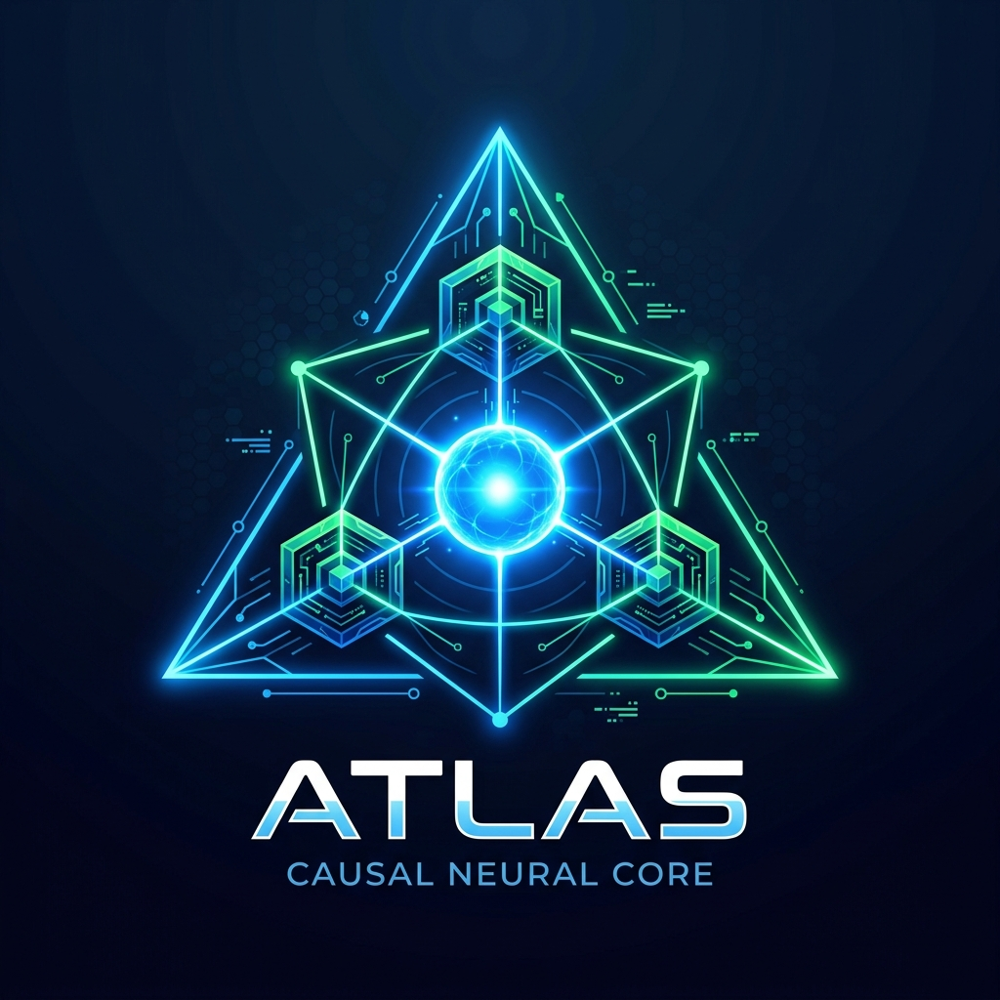
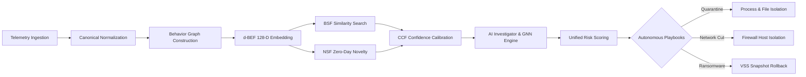

<p align="center">
  
</p>

<h1 align="center">ATLAS: Next-Generation Behavioral Cyber-Defense Platform</h1>
<p align="center">
  <b>Adaptive Threat Learning and Analysis System (BADNA)</b><br>
  <i>Behavior-First Cyber-Intelligence, Autonomous Playbooks, Causal GNN Reasoning & Zero-Day Resilience</i>
</p>

<p align="center">
  <a href="https://github.com/ashutosh-013/ATLAS-Nextgen-of-Behavioral-Cyber-Defense-"></a>
  <a href="https://www.python.org/"></a>
  <a href="#"></a>
  <a href="https://attack.mitre.org/"></a>
  <a href="#"></a>
</p>

---

## 📑 Table of Contents
- [Executive Overview](#-executive-overview)
- [Why ATLAS? The Paradigm Shift](#-why-atlas-the-paradigm-shift)
- [System Architecture & FROZEN Pipeline](#-system-architecture--frozen-pipeline)
- [Core Mathematical Foundations](#-core-mathematical-foundations)
  - [1. d-BEF: Directed Behavioral Embedding Function](#1-d-bef-directed-behavioral-embedding-function)
  - [2. BSF: Dirichlet Behavioral Similarity Function](#2-bsf-dirichlet-behavioral-similarity-function)
  - [3. NSF: Non-Parametric Novelty Scoring Function](#3-nsf-non-parametric-novelty-scoring-function)
  - [4. CCF: Confidence Calibration Function](#4-ccf-confidence-calibration-function)
  - [5. Autonomous 2-Layer Graph Convolutional Network (GNN)](#5-autonomous-2-layer-graph-convolutional-network-gnn)
- [Full Subsystems Breakdown](#-full-subsystems-breakdown)
  - [Autonomous Host Isolation & Firewall Pinholes](#autonomous-host-isolation--firewall-pinholes)
  - [Canary Decoys & Atomic VSS Shadow Copy Rollback](#canary-decoys--atomic-vss-shadow-copy-rollback)
  - [Live T-Pot Honeypot Syslog/EVE Streaming](#live-t-pot-honeypot-syslogeve-streaming)
  - [CISA KEV Threat Intelligence Fusion](#cisa-kev-threat-intelligence-fusion)
- [Interactive Web Dashboard & SOC Interface](#-interactive-web-dashboard--soc-interface)
- [Installation & Setup Guide](#-installation--setup-guide)
- [Quick Start: CLI & Unified Dashboard](#-quick-start-cli--unified-dashboard)
- [Verification & Multi-Agent Test Suites](#-verification--multi-agent-test-suites)
- [Repository Structure](#-repository-structure)
- [Development Guidelines](#-development-guidelines)
- [License & Citation](#-license--citation)

---

## 🌟 Executive Overview

**ATLAS** (Adaptive Threat Learning and Analysis System) is an enterprise-grade behavioral cyber-defense platform designed to address the fundamental limitations of modern EDR and SIEM solutions. 

Traditional cybersecurity relies on reactive signatures, fragile regex rules, and static Indicators of Compromise (IOCs) such as SHA-256 hashes or IP addresses. Modern threat actors easily circumvent these controls using polymorphic compile-time morphing, LOLBins (Living-off-the-Land binaries), memory-only execution, and zero-day exploits.

ATLAS solves this by treating attacker behavior as **Behavioral Attack DNA (BADNA)**. Rather than inspecting static artifacts, ATLAS captures the causal execution graph of processes, network sessions, registry alterations, and memory invocations, converting them into mathematical vectors embedded in a 128-dimensional Hilbert space.

```
          RAW TELEMETRY                SPECTRAL GRAPH                 128-D EMBEDDING               AUTONOMOUS
   [Process, Net, File, Reg]  ───►  [Causal Graph Laplacian]  ───►  [d-BEF Spectral DNA]  ───►  [Defense Playbook]
```

---

## ⚡ Why ATLAS? The Paradigm Shift

| Security Dimension | Traditional EDR / Antivirus | ATLAS Behavioral Platform |
| :--- | :--- | :--- |
| **Detection Basis** | File hashes, byte signatures, regex rules | Causal Directed Graph Laplacian & Behavioral DNA |
| **Zero-Day Resilience** | Blind until signatures are updated (hours/days) | Detects anomalous execution manifolds instantaneously via **NSF** |
| **Living-off-the-Land (LOLBins)** | Often whitelisted (`powershell.exe`, `cmd.exe`) | Evaluates execution topology, causal ancestry, and telemetry flow |
| **Alert Fatigue & Noise** | Uncalibrated heuristic scores, high false positives | Platt-scaled mathematical calibration via **CCF** with tension penalization |
| **Honeypot Correlation** | Isolated perimeter logs in SIEM silos | Live syslog & EVE-JSON ingestion fused with host behavioral DNA |
| **Ransomware Response** | Late detection after files are already encrypted | Tripwire Canary Traps trigger immediate VSS snapshot recovery |
| **Quantum Readiness** | Incompatible | Optional QUBO Quantum Optimizer with classical fallbacks |

---

## 🏗 System Architecture & FROZEN Pipeline

ATLAS strictly adheres to the **FROZEN Pipeline** architectural contract. Every telemetry event must pass through the complete behavioral pipeline—no IOC match or signature is permitted to bypass the behavioral engine:



---

## 🔬 Core Mathematical Foundations

### 1. d-BEF: Directed Behavioral Embedding Function
Transforms high-cardinality directed causal graphs $G = (V, E)$ of system activities into continuous vectors $\mathbf{z} \in \mathbb{R}^{128}$.
* Constructs the directed random-walk graph Laplacian:
  $$\mathcal{L}_{rw} = I - D_{out}^{-1} A$$
* Computes the normalized spectral eigen-decomposition:
  $$\mathcal{L} \mathbf{v}_k = \lambda_k \mathbf{v}_k$$
* Combines spectral eigenvalues with 64 domain-specific behavioral features (process branching entropy, network fanout, privilege variance, file churn).

### 2. BSF: Dirichlet Behavioral Similarity Function
Measures topological alignment between active threat embeddings $\mathbf{z}_{active}$ and known historical threat campaigns $\mathbf{z}_{camp}$ using Dirichlet-weighted cosine similarity:
$$\text{BSF}(\mathbf{z}_1, \mathbf{z}_2) = \sum_{k=1}^{K} w_k \frac{\mathbf{z}_{1,k} \cdot \mathbf{z}_{2,k}}{\|\mathbf{z}_{1,k}\|_2 \|\mathbf{z}_{2,k}\|_2}, \quad \sum w_k = 1$$

### 3. NSF: Non-Parametric Novelty Scoring Function
Calculates the probability that an observed execution behavior represents a zero-day or previously undocumented attack pattern:
$$\text{NSF}(\mathbf{z}) = 1 - \exp\left( -\min_{\mathbf{p} \in \mathcal{K}} \frac{\|\mathbf{z} - \mathbf{p}\|_2^2}{2 \sigma_{baseline}^2} \right)$$
Scores approaching $1.0$ indicate high-confidence zero-day behavior requiring immediate threat isolation.

### 4. CCF: Confidence Calibration Function
Eliminates arbitrary heuristic confidence boosts. CCF applies logistic Platt scaling penalized by the topological tension between graph features and classifier logits:
$$P(Y = 1 \mid s) = \frac{1}{1 + \exp(A \cdot s + B)}$$
$$\text{CCF} = \sigma(\text{Logit}) \times (1 - \mathcal{T}_{tension}) \times \mathcal{Q}_{evidence}$$

### 5. Autonomous 2-Layer Graph Convolutional Network (GNN)
Located in `behavior/gnn_engine.py`, the GNN performs message passing over process-network causal graphs:
$$H^{(l+1)} = \sigma\left( \tilde{D}^{-\frac{1}{2}} \tilde{A} \tilde{D}^{-\frac{1}{2}} H^{(l)} W^{(l)} \right)$$
Generates node-level attack stage classifications and detects lateral movement hops without external dependencies.

---

## 🛡 Full Subsystems Breakdown

### Autonomous Host Isolation & Firewall Pinholes
* **Module**: `firewall_manager.py` (`CrossPlatformFirewallManager`)
* **Capability**: Real Windows `netsh advfirewall` rules that sever all inbound and outbound host traffic during critical security incidents.
* **SOC Safety Pinholes**: Automatically preserves loopback (`127.0.0.1`), configured SOC telemetry collectors, and internal management subnets so analysts never lose shell access to compromised endpoints.

### Canary Decoys & Atomic VSS Shadow Copy Rollback
* **Modules**: `behavior/canary_engine.py`, `playbook_engine.py`, `intelligence/rollback.py`
* **Mechanism**: Plants hidden tripwire decoy documents in sensitive directories (`Desktop`, `Documents`).
* **Instant Recovery**: When a ransomware process touches or encrypts a canary file, ATLAS instantly triggers:
  1. SIGKILL on the offending process tree (`psutil.Process.terminate()`).
  2. Surgical network quarantine.
  3. Reversion to pre-attack state using Windows Volume Shadow Copies (`vssadmin.exe`).

### Live T-Pot Honeypot Syslog/EVE Streaming
* **Modules**: `tpot_live_service.py`, `tpot_engine.py`, `tpot_correlation.py`
* **Real-time Ingestion**: Spawns a multi-threaded UDP/TCP Syslog and Suricata EVE-JSON daemon (ports 514 / 1514).
* **Correlation**: Ingests brute-force SSH attempts (Cowrie), web exploits, and network probes, correlating external honeypot adversary IPs directly with internal host behavioral observations.

### CISA KEV Threat Intelligence Fusion
* **Module**: `intelligence/ioc_repository.py`
* **Telemetry Correlation**: Normalized database containing **1,635+ CISA Known Exploited Vulnerabilities (KEV)**.
* **Separation of Concerns**: Kept strictly isolated from the Behavioral Knowledge Base, ensuring telemetry always receives complete behavioral feature extraction.

---

## 🖥 Interactive Web Dashboard & SOC Interface

The unified ATLAS Dashboard features a modern glassmorphic interface powered by Vanilla CSS and real-time Server-Sent Events (SSE):

<p align="center">
  
</p>

* **Causal Graph Visualizer**: Real-time interactive inspection of process spawn trees, network connections, and file handles.
* **10-Stage Attack Storyboard**: Reconstructs complete multi-stage campaigns from initial access to data exfiltration.
* **MITRE ATT&CK Matrix Heatmap**: Live coverage overlay displaying observed adversary tactics.
* **Playbook Execution Console**: One-click or autonomous triggering of surgical containment playbooks.
* **Executive & Technical AI Forensics**: Auto-generated forensic reports ready for C-suite and SOC escalation.

---

## 📦 Installation & Setup Guide

### 1. Prerequisites
* **Operating System**: Windows 10/11 or Windows Server (for full `netsh` & `vssadmin` integration); Linux/macOS fully supported in cross-platform fallback mode.
* **Python**: `3.10`, `3.11`, or `3.12`
* **Administrator Privileges**: Required only for live firewall isolation and VSS rollback operations.

### 2. Clone & Install Dependencies
```bash
# Clone the repository
git clone https://github.com/ashutosh-013/ATLAS-Nextgen-of-Behavioral-Cyber-Defense-.git
cd ATLAS-Nextgen-of-Behavioral-Cyber-Defense-

# Create and activate a virtual environment (recommended)
python -m venv venv
# Windows:
.\venv\Scripts\activate
# Linux/macOS:
source venv/bin/activate

# Install core dependencies
pip install -r requirements.txt
```

---

## 🚀 Quick Start: CLI & Unified Dashboard

### Option A: Launch the Unified Web Dashboard (Recommended)
Double click `start_atlas.bat` or run:
```bash
python run_frontend.py
```
* Binds the Flask backend and SSE stream engine to `http://localhost:5000`.
* Automatically launches your default web browser to the interactive dashboard.

### Option B: Command Line Interface (CLI)
```bash
# Analyze a security event sequence from a JSON capture
python main.py analyze --file tests/apt.json --pretty

# Inspect orchestrator status and loaded behavioral patterns
python main.py status

# Run built-in self-tests
python main.py test
```

### Option C: Start the Live T-Pot Honeypot Receiver
```bash
# Listen for real T-Pot / Cowrie / Suricata syslog telemetry
python tpot_live_service.py --port 514 --protocol UDP
```

---

## 🧪 Verification & Multi-Agent Test Suites

ATLAS includes a comprehensive test suite covering mathematical invariants, unit logic, and multi-agent supervisor validation:

```bash
# Run the complete regression suite (112 tests)
pytest tests/ -v
```

### Automated Test Coverage Breakdown
| Test Suite / Supervisor | Description | Status |
| :--- | :--- | :--- |
| `tests/test_behavioral_core_supervisor.py` | Validates $d$-BEF 128-D embeddings, BSF Dirichlet weights, NSF, and CCF calibration | ✅ 100% Passed |
| `tests/test_four_subsystems_upgrade.py` | Validates T-Pot live service, Host Isolation, VSS Snapshot, and GNN engine | ✅ 100% Passed |
| `tests/test_playbook_supervisor.py` | Validates autonomous containment, process kills, and rollback execution | ✅ 100% Passed |
| `tests/test_threat_intel_supervisor.py` | Validates 1,635 CISA KEV lookups and memory isolation | ✅ 100% Passed |
| `tests/test_analytics_supervisor.py` | Validates risk scoring, MTTD/MTTR metrics, and MITRE heatmap aggregation | ✅ 100% Passed |
| `tests/test_validation_supervisor.py` | Mathematical property-based invariant verification | ✅ 100% Passed |

---

## 📁 Repository Structure

```
ATLAS-Nextgen-of-Behavioral-Cyber-Defense-/
├── behavior/
│   ├── canary_engine.py          # Decoy tripwire ransomware traps
│   ├── dbef.py                   # d-BEF 128-D spectral graph embedding engine
│   └── gnn_engine.py             # 2-layer Graph Convolutional Network
├── confidence/
│   └── ccf.py                    # Platt scaling & confidence calibration
├── frontend/
│   ├── atlas_logo.jpg            # Official Causal Neural Core emblem
│   ├── index.html                # Unified dark-mode dashboard markup
│   ├── styles.css                # 60 FPS glassmorphic design system
│   └── app.js                    # SSE streaming client & dynamic visualizations
├── intelligence/
│   ├── investigator.py           # Multi-model intent and attack stage classification
│   ├── ioc_repository.py         # CISA KEV repository (1,635+ CVEs)
│   ├── rollback.py               # VSS shadow copy restoration engine
│   ├── self_defense.py           # Anti-tampering & integrity monitoring
│   └── threat_intel_fusion.py    # IOC-to-telemetry fusion logic
├── knowledge_base/
│   ├── behavior_memory.json      # Persistent behavioral pattern vectors
│   ├── campaigns.json            # Known threat campaign signatures
│   └── knowledge_base.py         # Knowledge repository manager
├── novelty/
│   └── nsf.py                    # Novelty scoring function (Zero-day detector)
├── similarity/
│   └── bsf.py                    # Dirichlet behavioral similarity engine
├── tests/                        # 112 multi-agent test suites
├── analytics_engine.py           # Unified telemetry metrics & MTTD/MTTR calculation
├── campaign_engine.py            # Multi-stage incident tracking
├── firewall_manager.py           # Netsh host isolation with SOC pinholes
├── main.py                       # Core BADNA orchestrator & CLI
├── playbook_engine.py            # Autonomous containment playbooks
├── run_frontend.py               # Dashboard launcher
├── telemetry_schema.py           # Canonical event schemas
├── tpot_live_service.py          # Live Syslog / EVE-JSON honeypot daemon
└── web_app.py                    # Unified Flask REST & SSE streaming server
```

---

## 📜 Development Guidelines

When contributing to ATLAS, please observe our core architectural principles:
1. **Behavior-First**: Signatures and IOCs are supporting modules. Telemetry must never bypass BADNA.
2. **Strict Separation of Concerns**: Keep IOC repositories separated from the Behavioral Knowledge Base.
3. **Calibrated Confidence**: Always use CCF—never introduce hardcoded heuristic confidence boosts.
4. **Resilient Fallbacks**: Every advanced hardware optimization (such as Quantum QUBO) must provide classical fallbacks.
5. **Real-World Fidelity**: Code must be tested against live Windows APIs, actual syslogs, and verified datasets.

---

## 📄 License & Citation

Distributed under the Apache 2.0 License. See `LICENSE` for more information.

If you use ATLAS or the BADNA algorithms in your research, please cite:

```bibtex
@software{atlas_badna_2026,
  title={ATLAS: Next-Generation Behavioral Cyber-Defense & Attack DNA Platform},
  author={Ashutosh & ATLAS Contributors},
  year={2026},
  url={https://github.com/ashutosh-013/ATLAS-Nextgen-of-Behavioral-Cyber-Defense-}
}
```

<p align="center">
  <b>Built for resilient, behavior-first cyber defense.</b>
</p>
